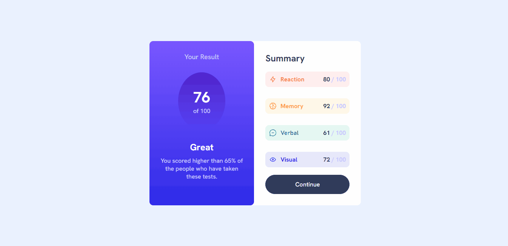
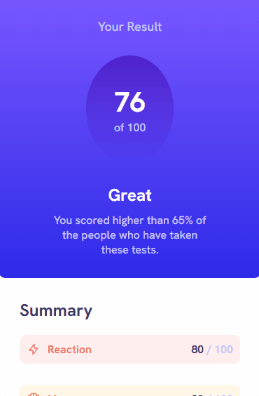

# Desafio Summary Results - Frontend-Mentor

Este é um desafio de um sumário de resultados, proposto pelo site Frontend-Mentor.

## Tabela de Conteúdos

- [Visão Geral](#visão-geral)
    - [Imagens](#imagens)
    - [Link da página](#link)
- [Processo](#processo)
    - [Linguagens utilizadas](#linguagens-utilizadas)
    - [O que aprendi](#o-que-aprendi)
    - [Possíveis evoluções](#possíveis-evoluções)
- [Autor](#autor)

## Visão-geral

### Imagens

<br>

````
Versão de Desktop
````

   

<br>

````
Versão Mobile
````

 

### Link

- Página no GitHub Pages: <a href="https://julio-mansan2.github.io/summary-results/">Clique aqui!</a>

## Processo

### Linguagens utilizadas

<br>

- Marcações semânticas de HTML5
- Propriedades de customização do CSS3

<br>

### O que aprendi

<br>

- Utilizar variáveis:

````css

:root {
    --pale-blue: hsl(221, 100%, 96%);
    --white: hsl(0, 0%, 100%);
    --light-slate-blue: hsl(252, 100%, 67%);
    --light-royal-blue: hsl(241, 81%, 54%);
    --light-lavender: hsl(241, 100%, 89%);
    --dark-gray-blue: hsl(224, 30%, 27%);
    --light-red: hsl(0, 100%, 67%);
    --orangey-yellow: hsl(39, 100%, 56%);
    --green-leal: hsl(166, 100%, 37%);
    --cobalt-blue: hsl(234, 85%, 45%);
    --reaction-bg: hsl(0, 100%, 67%, 0.10);
    --memory-bg: hsl(39, 100%, 56%, 0.10);
    --verbal-bg: hsl(166, 100%, 37%, 0.10);
    --visual-bg: hsl(234, 85%, 45%, 0.10);
    --violet-blue: hsla(256, 72%, 46%, 1);
    --persian-blue: hsla(241, 72%, 46%, 0);
}


````

- Utilizar pseudo-seletores:

````css

.summary li div:first-child {
    display: flex;
    gap: 0.625rem;
}

````
<br>

### Possíveis evoluções

<br>

- Em razão da simplicidade do projeto, sua construção se sucedeu sem muitas adversidades.

<br>

## Autor

GitHub - <a href="https://github.com/julio-mansan2">julio-mansan2</a> <br>
Front-end Mentor - <a href="https://www.frontendmentor.io/profile/julio-mansan2">julio-mansan2</a> <br>
LinkedIn - <a href="https://www.linkedin.com/in/j%C3%BAlio-a-mansan-3415a7249/">Júlio A.</a> <br>